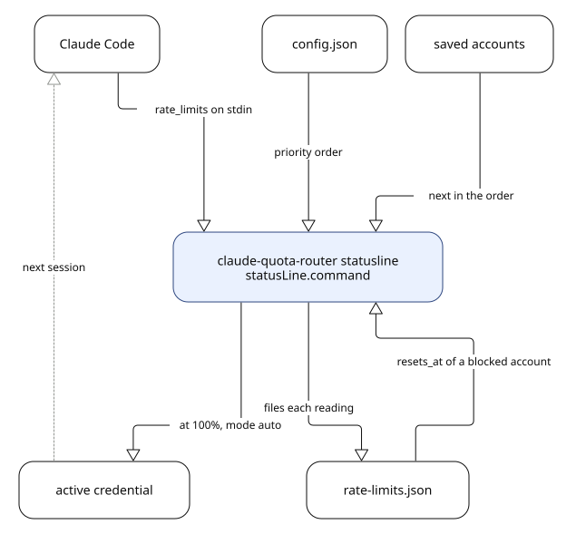

# Claude Quota Router

Claude Quota Router keeps Claude Code on an account that still has quota. It reads the quota Claude Code hands to the statusline, remembers what each saved account had left when you were last on it, and moves the active credential down an order you set. Personal, team, and enterprise plans are all routed the same way.



## Install

```bash
./install.sh
```

The script builds the binary, copies it to `~/.local/bin`, and adds that directory to `PATH` in the file your login shell reads. [docs/install.md](docs/install.md) covers the options, a manual build, and Windows.

## Quick start

Save each login once, while that account is the one Claude Code is signed in to.

```bash
claude-quota-router setup
claude-quota-router install
claude-quota-router config --priority me@work.com,me@gmail.com
claude-quota-router list
```

`setup` names the account after the email `claude auth status` reports, and `install` wraps the statusline command you already have rather than replacing it. From there, `switch`, `toggle`, and `status` drive the router by hand, and `config --mode auto` lets it switch on its own.

## Removing it

```bash
./uninstall.sh --purge
```

This restores your old statusline command, deletes the saved credentials and this tool's directory, and takes the binary and the `PATH` line back off. Drop `--purge` to keep the saved accounts for later. The account Claude Code is signed in to is never touched.

## Documentation

| Document | Contents |
|---|---|
| [docs/routing.md](docs/routing.md) | How the order and the cached readings pick an account, and what the statusline prints |
| [docs/platforms.md](docs/platforms.md) | Credential stores, notifications, and file locations per platform |
| [docs/install.md](docs/install.md) | Install options, manual build, and the statusline wrapper |
| [docs/development.md](docs/development.md) | Module layout, checks, and adding a platform backend |

## License

MIT. See [LICENSE](LICENSE).
